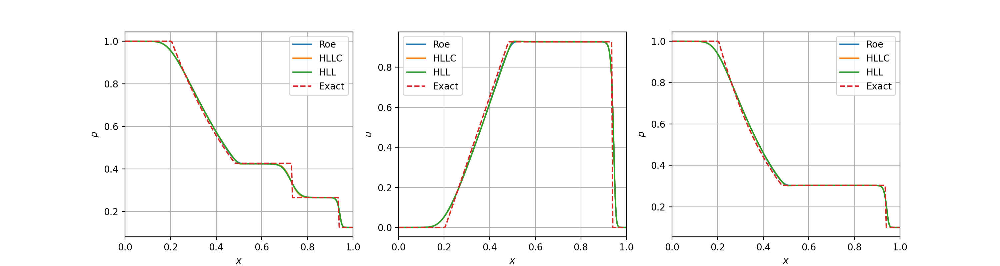

# 1D Euler equation solve written in Python

This code can solve 1D shock tube problem using FVM method. Currently the following Riemann solvers are implemented:

* Godunov (Exact Riemann solver)
* Roe
* AUSM
* HLL
* HLLC

Note that the Godunov Riemann solver is rewritten from this repository: [ToroExact](https://github.com/tahandy/ToroExact). Other approximate Riemann solvers mainly refers to Toro's book: *Riemann Solvers a n d Numerical Methods for Fluid Dynamics* and this MATLAB code: [Approximate Riemann Solvers](https://github.com/wme7/ApproximateRiemannSolvers).

And the code supports two reconstruction methods:

* 0-order
* MUSCL-TVD

Two time-advancement techniques are implemented:

* 4th-order Runge-Kutta
* 3rd-order Runge-Kutta
* Euler time-advancement

Below is the result of SOD shock tube problem (t = 0.25) solved by Godunov, Roe, HLL, and HLLC method. The computational domain consists 300 cells and 0-order reconstruction is used.

The initial condition, the location of discontinuity, and the numerical methods can be specified in the control files. The examples of control files can be found in `*Test` directories.