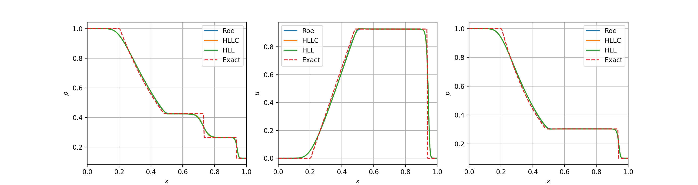
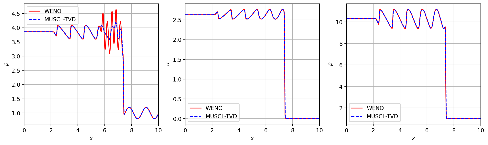

# 1D Euler equation solve written in Python

This code can solve 1D shock tube problem using FVM method. Currently the following Riemann solvers are implemented:

* Godunov (Exact Riemann solver)
* Roe
* AUSM
* HLL
* HLLC

Note that the Godunov Riemann solver is rewritten from this repository: [ToroExact](https://github.com/tahandy/ToroExact). Other approximate Riemann solvers mainly refers to Toro's book: *Riemann Solvers a n d Numerical Methods for Fluid Dynamics* and this MATLAB code: [Approximate Riemann Solvers](https://github.com/wme7/ApproximateRiemannSolvers).

And the code supports two reconstruction methods:

* 0th-order
* MUSCL-TVD
* 5th-order WENO

Three time-advancement techniques are implemented:

* 3th-order Runge-Kutta
* 4rd-order Runge-Kutta
* Euler time-advancement

On the other hand, the code also supports WENO 5th-order finite-difference discretization using characteristic decomposition method to compute the flux. To make the code operate in finite-difference mode, just set the argument `FD` to `True` when the `Euler1D` object is instantiated.
```
solver = Euler1D.Euler1D("./HLLCTest_WENO/SOD-WENO.txt", FD = True)
```

Below is the result of SOD shock tube problem (t = 0.25) solved by Godunov, Roe, HLL, and HLLC method. The computational domain consists 300 cells and 0-order reconstruction is used.



Shu-Ohser problem is solved on 500 cells using the MUSCL-TVD method and the 5th-order WENO method. HLLC Riemann solver gives the flux on the interface. It can be seen that the 5-th order WENO method gives a much better resolution of the high frequency 
oscillation near the discontinuity.



The initial condition, the location of discontinuity, and the numerical methods can be specified in the control files. The examples of control files can be found in `*Test` directories.